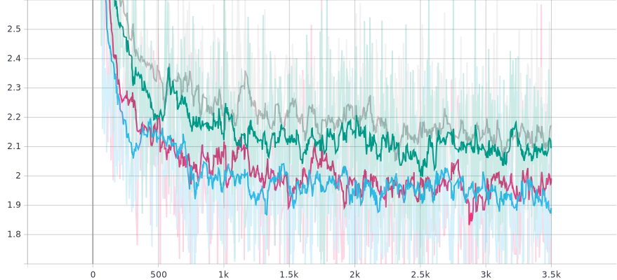
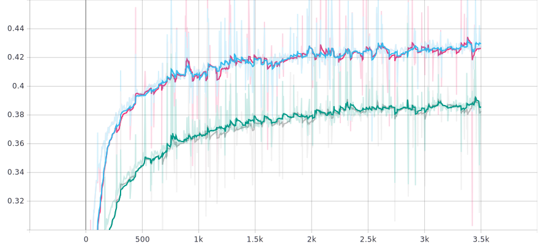

# Homework #4 (Optional) Music Transformer: Generating Music with Long-Term Structure

- 2019 ICLR, Cheng-Zhi Anna Huang, Google Brain
- Re-producer : Yang-Kichang
- [paper link](https://arxiv.org/abs/1809.04281) 
- [paper review](https://github.com/SSUHan/PaparReviews/issues/13)

This homework strongly refers to (https://github.com/jason9693/MusicTransformer-pytorch), with some minor changes.


# About the homework

The main goal of this homework is to understand basic symbolic music generation mechanism, by delving into the code structures of the pytorch implementation version of the paper 'Music Transformer: Generating Music with Long-Term Structure'. This paper utilizes the decoder part of the well-known transformer model, and generate midi events in an autoregressive manner. Transformer model is notorious on its heavy computational cost, which increases quadratically to the input length, $O(L^2)$. The model also utilizes relative positional self-attention (which is not the scope of our homework, but will be seen in the codes.), which will increase the total cost to $O(L^2D + L^2)$.  
The main contribution of this paper is introducing 'Relative Global Attention', which reduced the space complexity on obtaining relative embeddings. Therefore the total space complexity is reduced from $O(L^2D + L^2)$ to $O(LD + L^2)$. However, this main contribution part is out of our scope, we will target on understanding the overall code structure only. This includes **1) Preprocessing the midi into events. 2) How the transformer decoder model is built 3) How the model is trained in the train phase, and how it generates in the (infer)generating phase.**

Overall structure are as follows:

config 


## Simple Start ( Repository Setting )

After you've cloned this repository:

```bash

$ conda create -n 634hw4 python=3.7
$ conda activate 634hw4
$ sudo apt-get install gcc libgirepository1.0-dev libcairo2-dev pkg-config python3-dev gir1.2-gtk-3.0 libapt-pkg-dev
$ cd gct634-2022-hw4
$ pip install -r requirements.txt
# if there's warning, press 'w' and continue
$ conda config --set ssl_verify no
$ pip3 --default-timeout=500 install torch torchvision torchaudio
$ pip install tensorflow tqdm

```


## Preprocessing midi into events


* MIDI files of [Maestro dataset](https://magenta.tensorflow.org/datasets/maestro) are used for training.
  Download the maestro-v3.0.0-midi.zip (81MB uncompressed)

* make directory named 'dataset' and unzip the zip file inside the directory.

* We brought the preprocess implementation repository from [here](https://github.com/jason9693/midi-neural-processor).
  As we've learned from lectures, the MIDI file is represented to event numbers from 0 ~ 388.
  The last number 388 is the padding token.
  
  

After unzip, execute:
```bash
$ python preprocess.py ./dataset/maestro-v3.0.0 ./dataset/midi
```

## Train

Execute:
```bash
python3 train.py -m ./exp_config/train_base_results -c ./config/base.yml ./config/train.yml
```

##  Tensorboard for visualization!

Execute:
```bash
tensorboard --logdir logs/embedding256-layer6 --port 6006
```
Connect to https://localhost:6006 , and you should see the logged data!


## Hyper Parameter

* learning rate : 0.0001
* head size : 4
* number of layers : 6
* seqence length : 2048
* embedding dim : 256 (dh = 256 / 4 = 64)
* batch size : 2


## Result

-  Baseline Transformer ( Green, Gray Color ) vs Music Transformer ( Blue, Red Color )

* Loss

  

* Accuracy

  


## Generate Music

```bash
$ python3 generate.py -m ./exp_config/E_require_grad_true -c ./config/base.yml ./config/generate.yml
```

## Some things to think about

1. 


## Generated Samples ( Youtube Link )

* click the image.

  [](https://www.youtube.com/watch?v=n6pi7QJ6nvk&list=PLVopZAnUrGWrbIkLGB3bz5nitWThIueS2)
